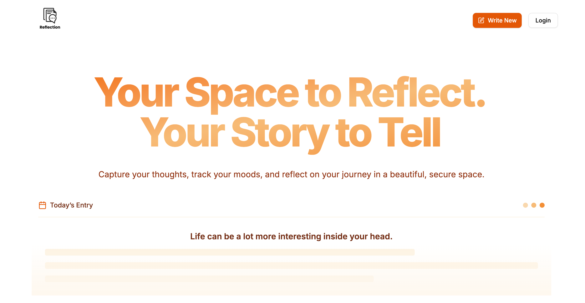

# Reflection Hub



**Reflection Hub** is a Next.js application built as a platform for journaling, self-reflection, or capturing personal insights over time. It provides users with a smooth, responsive UI and supports modern react/next features.

---

## Table of Contents

- [Features](#features)  
- [Demo / Live Site](#demo--live-site)  
- [Tech Stack](#tech-stack)  
- [Getting Started](#getting-started)  
  - [Prerequisites](#prerequisites)  
  - [Installation](#installation)  
  - [Development](#development)  
  - [Environment Variables](#environment-variables)  
- [Project Structure](#project-structure)  
- [Usage & Examples](#usage--examples)  
- [Deployment](#deployment)  

---

## Features

- User-friendly interface for journaling or reflection entries  
- Responsive design (mobile / tablet / desktop)  
- Client-side and server-side features via Next.js  
- Data persistence (via Prisma / database)  
- Custom components, hooks, and utility libraries  
- Modular and maintainable code structure  

---

## Demo / Live Site

You can try the live deployment here:  
[reflection-hub.vercel.app](https://reflection-hub.vercel.app/)

---

## Tech Stack

- **Framework:** Next.js
- **Language:** JavaScript 
- **Styling / UI:**  Tailwind 
- **Database / ORM:** Prisma (folder `prisma/`)  
- **Other tools / libs:**  
  - Custom hooks (in `hooks/`)  
  - Shared UI components (in `components/`)  
  - Utility / lib functions (in `lib/`)  

---

## Getting Started

### Prerequisites

Make sure you have installed:

- Node.js (v16+ or LTS)  
- npm, yarn, or pnpm  
- (Optional) A database server (PostgreSQL, SQLite, MySQL, etc.) if using Prisma  

### Installation

```bash
git clone https://github.com/Elijah-cod/reflection-hub.git
cd reflection-hub
npm install
# or
yarn install
# or
pnpm install
```
### Development

Start the development server:
```bash
npm run dev
# or
yarn dev
# or
pnpm dev
```

Open your browser and go to http://localhost:3000
. Changes you make to app/, components/, etc. will auto-refresh.

### Environment Variables

Create a .env.local at the root, and set variables, for example:
```ini
DATABASE_URL="your_database_connection_string"
NEXTAUTH_SECRET="a_long_random_secret"
# any other keys your app uses...
```

Then run Prisma migrations (if applicable):
```bash
npx prisma migrate dev
```
## Project Structure

Here is a simplified view of key directories:
```text
.
├── app/                   # Next.js app pages / routes
├── components/            # UI / reusable components
├── data/                  # seed data or static data
├── hooks/                 # custom React hooks
├── lib/                   # utility / helper functions
├── prisma/                # Prisma schema & migrations
├── public/                # static assets (images, icons, etc.)
├── middleware.js          # Next.js middleware
├── next.config.mjs        # Next.js config
├── package.json  
└── README.md              
```

You may expand or adapt this structure as your project evolves.

## Usage & Examples

Here are some example flows users might take:

* **Create a new reflection entry:** Navigate to the “New” page, enter title / body / tags, click submit.

* **View past entries:** On the home/dashboard page, see a list of reflections ordered by date.

* **Edit / Delete:** Each entry may have options to edit or delete, confirming before deletion.

* **Search / Filter (optional):** Filter by date range, tags, or keywords.

You may want to include code snippets or component usage examples here, e.g.:
```jsx
import { useReflection } from '@/hooks/useReflection';

function ReflectionForm() {
  const { createReflection } = useReflection();
  // ...
}
```
## Deployment

To deploy to Vercel (or any hosting that supports Next.js):

Push your code to GitHub (or link your repo).

Connect the repository to Vercel and set your environment variables in the Vercel dashboard.

Deploy — Vercel automatically builds and serves your Next.js app.

Alternatively, you can build locally and host it elsewhere:
```bash
npm run build
npm run start
```